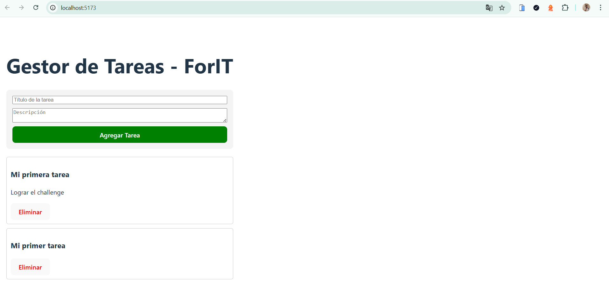

 🚀 Challenge Fullstack - Alexander Rivero

Este proyecto es la resolución del desafío técnico para el ingreso a la **Academia ForIT 2025**. Consiste en una aplicación de gestión de tareas (To-Do List) que demuestra conocimientos en Git, JavaScript, Node.js y React.

 🛠️ Requisitos Cumplidos
**Backend**: Servidor con Express y endpoints para CRUD completo (GET, POST, PUT, DELETE).
**Frontend**: Aplicación React con Vite, utilizando componentes para la lista y el formulario de tareas.
**Git**: Repositorio público organizado con carpetas separadas para frontend y backend.

# 📸 Captura de la Aplicación

